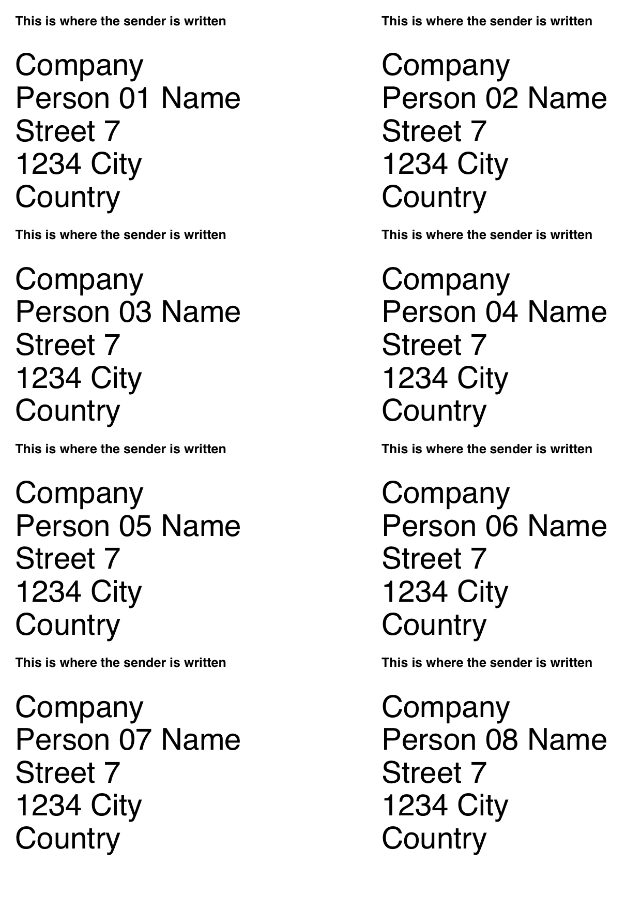

##Input is your AddressBook##
Open your addressbook and select any number of contacts, then left click (context menu).

##Output##

## Next steps ##

Verify or increase precsision 

[Australia format](http://auspost.com.au/education/letterwriting/students/addressing.html)

Verify ODT and HTML

JavaScript needs refactoring.

HTML could be precise.

OpenDocument and HTML should be validated.

PostScript could use a Unicode font.

##I am looking for a collaborator##
Do you want to collaborate?

Do you know JavaScript?

